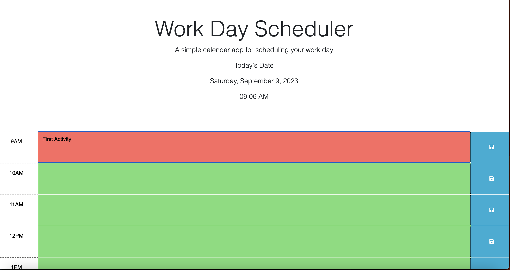

# Schedule The Day

## Repository

In this repository you will find the application code to a work day scheduler. The purpose of this application is to set events in a time block scheduler and have the ability to save each event so they persist upon page refresh. This is accomplished by using local storage. The dayjs library is used to grab the time in real time and use it to compare it against each time block by selecting the id with the respective hour number. jQuery is then used to add and remove classes from the time block elements so that they have the correct color that represents either past, present, or future. The basic functionality is as follows.

- Some text is entered in the text area.
- The save button is clicked, triggering the click event that stores the data in local storage.
- The current time is displayed with dayjs which keeps track of the current time.
- The current time is compared with the timeblock time which is indicated in the timeblock's id.
- This comparison determines the color of each timeblock to represent its current state. (past, present, future)
- The time, date, and respective color styles are dynamically updated with jQuery. 
- If the page is refreshed, the local storage data is retrieved so the the input history persists on the page.

The use of "this" inside each function offers a way to write code that is easier to read/understand in my personal opinion. jQuery has the same effect on me as its much easier to read and less code is written.

## Table of Contents

- [Contribute](#contribute)
- [Appearance](#appearance)
- [Changes](#changes)
- [Features](#features)
- [Credits](#credits)
- [License](#license)

## Contribute

To view the repository of this password generator and contribute to this application click the following link:  [Schedule The Day](https://github.com/lmansilla92/schedule-the-day)

If you need help on how to clone a GitHub repository into your local repository, visit the following GitHub link: [Cloning a repository](https://docs.github.com/en/repositories/creating-and-managing-repositories/cloning-a-repository) 

## Appearance

Schedule The Day:
    

To view the deployed webpage click the following link: [Deployed Webpage](https://lmansilla92.github.io/schedule-the-day)

## Changes

I would like to make the following changes to add features to this work day scheduler:

- Figure out a way to make the page load faster, I feel like the load speed can be improved.
- Add a feature to include an option to erase messages as they are in the "past".

## Features

Some of the features in this application include:

- Ability to edit the text area.
- Feature to save any input to local storage and then retrieve the data from local storage to display on the page.
- dayjs helps by getting the current time and let's that information be displayed on the page.
- jQuery's .parent and .siblings are used to select other elements depending on their relationship with the element in the current function

## Credits

- Link to the starter code [Repository Starter Code](https://github.com/coding-boot-camp/crispy-octo-meme)

## License

Link to [The MIT License (MIT)](https://github.com/lmansilla92/schedule-the-day/blob/main/LICENSE)